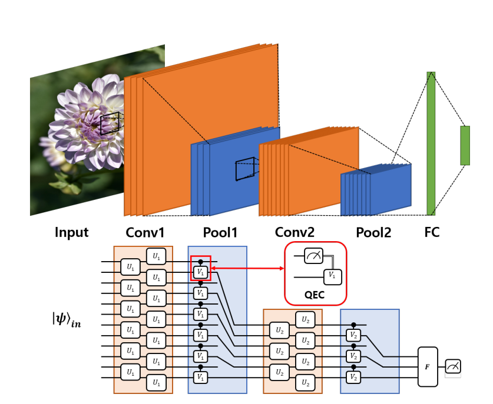

# Quantum-vs-Classical: Brain-Tumor-Classification using Quantum Machine Learning

# Objective

In this project we aim to understand the potential of quantum computers
in the field of machine learning. For this, we will classify brain 
tumor images into 3 respective tumors using a hybrid Quantum-Classical CNN model
and compare it against a Classical model (DenseNet121 model).

# About Dataset

Dataset Link: https://figshare.com/articles/dataset/brain_tumor_dataset/1512427/5

It is organized in matlab data format (.mat file). Each file stores a struct containing the following fields for an image:

- cjdata.label: 1 for meningioma, 2 for glioma, 3 for pituitary tumor
- cjdata.PID: patient ID
- cjdata.image: image data
- cjdata.tumorBorder: a vector storing the coordinates of discrete points on tumor border.
    - For example, [x1, y1, x2, y2,...] in which x1, y1 are planar coordinates on tumor border.
    - It was generated by manually delineating the tumor border. So we can use it to generate
    - binary image of tumor mask.
- cjdata.tumorMask: a binary image with 1s indicating tumor region

`Note`: Download all files and extract them. Next move all **.mat** files in one folder.

# Quantum Computers

Quantum computing is a type of computation whose operations can harness the phenomena of quantum mechanics, such as superposition, interference, and entanglement. Devices that perform quantum computations are known as quantum computers.[2][3] Though current quantum computers may be too small to outperform usual (classical) computers for practical applications, larger realizations are believed to be capable of solving certain computational problems, such as integer factorization (which underlies RSA encryption), substantially faster than classical computers. The study of quantum computing is a subfield of quantum information science.

For more details, see this video: https://www.youtube.com/watch?v=JhHMJCUmq28

# Quantum Convolutional Neural Network

For more details: 
1. https://arxiv.org/pdf/2009.09423.pdf
2. https://pennylane.ai/qml/demos/tutorial_quanvolution.html?fbclid=IwAR3Sw-OvDokiY1bzltvyyLHnnlPvlVTnAiwH3HqjTYpLxnjSbibGBfaSmTA
